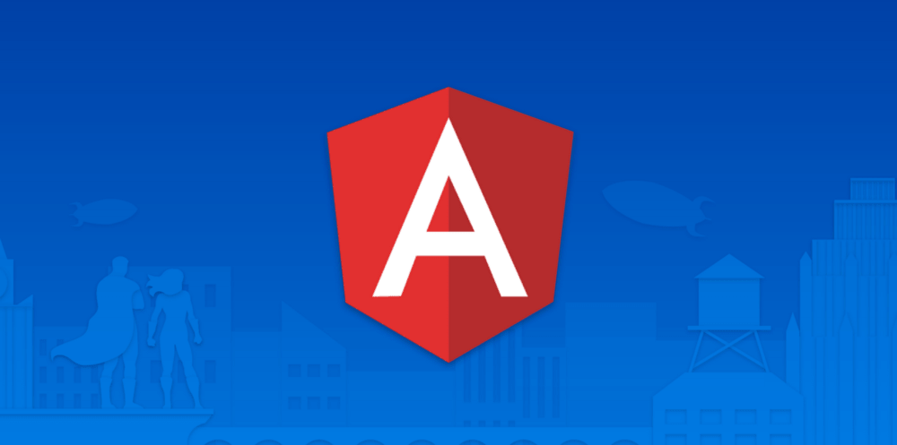

# GifsApp

### @ViewChild

- Hace posible acceder a elementos DOM nativos que tienen una variable de referencia de plantilla. Acepta clases css, elementos HTML, directivas, componente o un selector de referencia
- Non-null assertion operator __!__, se utiliza para ignorar los tipos indefinidos o nulos, durante el tiempo de ejecución.
- ``` _historial ``` Para identificar de forma visual que una propiedad es privado.

### Pipes |
- Los pipes nos permiten transformar visualmente la información
### Observables
### .subscribe
- Normalmente __.subscribe__ significa un arreglo para recibir algo.
- Se generada a partir del observable.
- Los suscriptores  son los que consumen los datos.

## Proyecto realizado.

