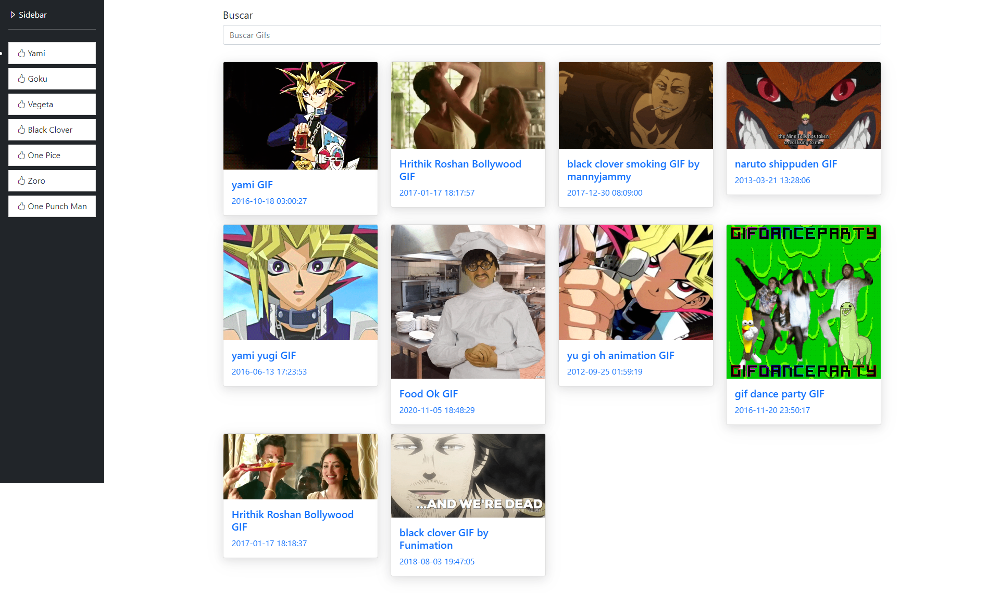

# Angular: De cero a experto (Angular 10+) (Legacy).
## Conocimientos adquiridos 🏆
1. Tener una base sólida para trabajar con Angular.
2. Crear aplicaciones en Angular siguiendo las mejores prácticas.
3. Dominar las directivas, pipes, componentes, servicios y la estructura de una aplicación de Angular.
4. Dominar TypeScript para crear aplicaciones en Angular.
5. Aplicar los conceptos nuevos del ECMAScript 6 en nuestros proyectos de Angular
  

